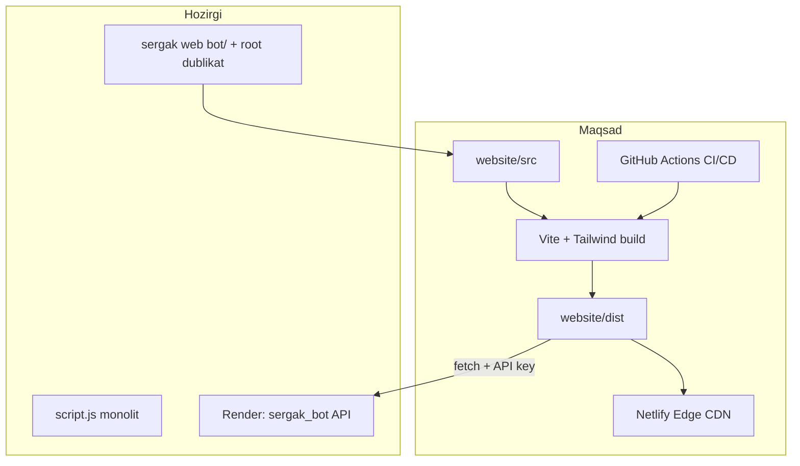
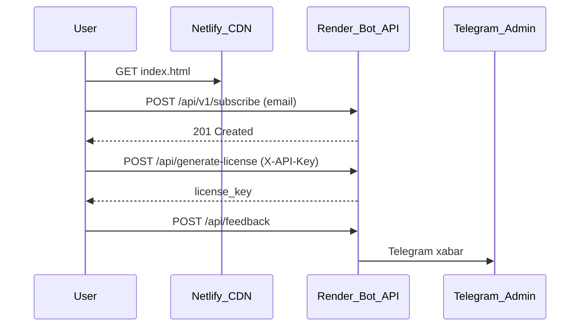

# SERGAK Veb-Sayt Qayta Qurish Rejasi (25 Task — To'liq)

## Joriy holat va muammolar

Hozir sayt `[sergak web bot/](C:\Users\ki770\OneDrive\Desktop\py_files\sergak web bot)` va root (`index.html`, `style.css`, `script.js`) da **dublikat** holda. Build pipeline yo'q, Tailwind yo'q, SEO/sitemap/robots yo'q, Lighthouse CI yo'q.

Aniqlangan kritik buglar (qayta qurishda tuzatiladi):

- Nav `#download` → section id `#download-section` (anchor ishlamaydi)
- CSP `connect-src 'self'` → Render API (`/api/generate-license`) bloklanadi
- `[netlify.toml](C:\Users\ki770\OneDrive\Desktop\py_files\netlify.toml)` `/* → /index.html` — `privacy.html`, `terms.html`, `windows.html` buziladi
- APK/Telegram tugmalar maintenance modal bilan bloklangan (`[script.js:304-327](C:\Users\ki770\OneDrive\Desktop\py_files\sergak web bot\script.js)`)
- `/api/generate-license` autentifikatsiyasiz (`[bot.py:883](C:\Users\ki770\OneDrive\Desktop\py_files\sergak_bot\bot.py)`)
- `logo.png` mavjud emas




---

## Yangi papka strukturasi

```
website/
├── docs/adr/ADR-001.md          # TASK-01
├── tokens.json                  # TASK-02
├── package.json
├── vite.config.js
├── tailwind.config.js
├── postcss.config.js
├── lighthouserc.js              # TASK-15
├── playwright.config.js         # TASK-21
├── netlify.toml                 # TASK-14, TASK-20
├── src/
│   ├── index.html               # TASK-05B — barcha sectionlar
│   ├── privacy.html             # TASK-22
│   ├── terms.html               # TASK-22
│   ├── windows.html
│   ├── css/input.css            # Tailwind + design tokens
│   ├── js/
│   │   ├── main.js              # navbar, demo, FAQ
│   │   ├── forms.js             # TASK-18 lead + checkout
│   │   ├── analytics.js         # TASK-23
│   │   └── ab-test.js           # TASK-25
│   └── partials/                # nav, footer, cookie-banner
├── public/
│   ├── robots.txt               # TASK-16
│   ├── sitemap.xml              # TASK-16
│   ├── manifest.json
│   └── assets/                  # TASK-03 — WebP, SVG, favicons, OG
└── tests/e2e/                   # TASK-21
```

**Eski papkalar:** `sergak web bot/` va root HTML fayllar deprecate qilinadi (README da yo'naltirish). Netlify `publish = "website/dist"`.

---

## Task bo'yicha implementatsiya

### Foundation (TASK-01 — TASK-04)


| Task        | Ish                                                                                                                                                                                                                                                |
| ----------- | -------------------------------------------------------------------------------------------------------------------------------------------------------------------------------------------------------------------------------------------------- |
| **TASK-01** | `[website/docs/adr/ADR-001.md](website/docs/adr/ADR-001.md)` — Option B tanlovi, section/route ro'yxati (Hero, Features, Demo, Pricing, Testimonials, FAQ, Download, Footer, Legal)                                                                |
| **TASK-02** | `tokens.json` + `src/css/input.css` da CSS custom properties: Inter/Poppins, ranglar (`--primary`, `--cyan`), spacing, button variants — mavjud `[style.css](C:\Users\ki770\OneDrive\Desktop\py_files\sergak web bot\style.css)` rang palitrasidan |
| **TASK-03** | `public/assets/` — hero illustration, OG 1200x630, favicon set, SVG iconlar; WebP + `<picture>` (TASK-07B bilan birga)                                                                                                                             |
| **TASK-04** | `remake-landing` branch, `npm run dev` / `npm run build` skriptlar, `.env.example` (`VITE_API_URL`, `VITE_API_KEY`)                                                                                                                                |


**Option A (TASK-05A..12A):** ADR da hujjatlashtiriladi, implement qilinmaydi (spec bo'yicha Option B tanlangan).

### Static Core — Option B (TASK-05B — TASK-07B)


| Task         | Ish                                                                                                                                                                                                                    |
| ------------ | ---------------------------------------------------------------------------------------------------------------------------------------------------------------------------------------------------------------------- |
| **TASK-05B** | Semantic HTML5: `<nav>`, `<main>`, `<section>`, `<article>`, `<footer>`. Mavjud kontent port qilinadi (8 feature, radar demo, Windows promo, team, comparison, pricing, testimonials, FAQ, download verification card) |
| **TASK-06B** | Vite + Tailwind + PostCSS + Autoprefixer + cssnano; `npm run build` → minified CSS < 15KB (purge)                                                                                                                      |
| **TASK-07B** | `<picture>` + `srcset` + explicit width/height; lazy loading `loading="lazy"`                                                                                                                                          |


**Tuzatishlar port paytida:**

- `#download` → `#download-section` (yoki section id ni `#download` qilish)
- Maintenance modal olib tashlanadi; Telegram/APK havolalar ishlaydi (`https://t.me/sergakaibot`)
- `translations.js` i18n — nav/footer ga `#langUz` / `#langRu` toggle qo'shiladi

### Shared Quality (TASK-13, TASK-16, TASK-17)


| Task        | Ish                                                                                           |
| ----------- | --------------------------------------------------------------------------------------------- |
| **TASK-13** | Critical CSS inline (Vite plugin), font preload, JS `defer`; LCP target < 2.5s                |
| **TASK-16** | JSON-LD (`Organization`, `SoftwareApplication`), OG/Twitter meta, `sitemap.xml`, `robots.txt` |
| **TASK-17** | Skip link, `:focus-visible`, ARIA labels, kontrast 4.5:1, keyboard nav; Lighthouse A11y ≥ 95  |


### Infrastructure (TASK-14)

`[website/netlify.toml](website/netlify.toml)`:

```toml
[build]
  command = "npm run build"
  publish = "dist"

[[headers]]
  for = "/*"
  [headers.values]
    Strict-Transport-Security = "max-age=63072000"
    X-Frame-Options = "DENY"
    X-Content-Type-Options = "nosniff"
    Content-Security-Policy = "default-src 'self'; connect-src 'self' https://sergak-z8tf.onrender.com; ..."

[[headers]]
  for = "/assets/*"
  [headers.values]
    Cache-Control = "public, max-age=31536000, immutable"
```

SPA fallback faqat kerakli route'lar uchun (404.html alohida).

### Features + Backend (TASK-18, TASK-19)


| Task        | Ish                                                                                        |
| ----------- | ------------------------------------------------------------------------------------------ |
| **TASK-18** | Lead capture form (email) — client regex validation, loading/error/success toast           |
| **TASK-19** | Backend `[sergak_bot/bot.py](C:\Users\ki770\OneDrive\Desktop\py_files\sergak_bot\bot.py)`: |


Backend o'zgarishlari:

```python
# Yangi endpoint
POST /api/v1/subscribe  → { email } → 201 / rate limit 5/min/IP

# Mavjud endpoint xavfsizligi
POST /api/generate-license → X-API-Key header talab qilinadi (env: API_KEY)
POST /api/feedback → rate limit + optional API key
```

- `generate_license_key()` helper — takrorlangan RSA/HMAC kod bitta joyga
- `[render.yaml](C:\Users\ki770\OneDrive\Desktop\py_files\render.yaml)` ga `API_KEY` env qo'shiladi
- Frontend `[forms.js](website/src/js/forms.js)`: checkout + feedback + subscribe API chaqiruvlari, CSP bilan mos `connect-src`

### CI/CD (TASK-15, TASK-20)

Yangi workflow: `[.github/workflows/website.yml](.github/workflows/website.yml)`

```
PR → lint (eslint) → build → Lighthouse CI (perf ≥ 80, a11y ≥ 90) → Playwright smoke
main merge → Netlify production deploy (NETLIFY_AUTH_TOKEN, NETLIFY_SITE_ID secrets)
PR → Netlify deploy preview
```

### QA, Legal, Growth (TASK-21 — TASK-25)


| Task        | Ish                                                                                                       |
| ----------- | --------------------------------------------------------------------------------------------------------- |
| **TASK-21** | Playwright: page load, hero CTA click, nav anchor scroll, form submit (Chromium/Firefox/WebKit)           |
| **TASK-22** | `privacy.html`, `terms.html` yangilash; cookie consent banner (`localStorage` preference)                 |
| **TASK-23** | Plausible yoki GA4 — funnel events: `landing_view`, `cta_click`, `form_submit`, `checkout_success`        |
| **TASK-24** | Pre-launch checklist doc; UptimeRobot/Pingdom → Slack webhook (README da setup)                           |
| **TASK-25** | `ab-test.js` — Hero headline va CTA rang variantlari; `localStorage` variant assignment + analytics event |


---

## Backend ↔ Frontend integratsiya oqimi




---

## Migratsiya va deprecate

1. Mavjud `[sergak web bot/](C:\Users\ki770\OneDrive\Desktop\py_files\sergak web bot)` kontenti `website/src/` ga port qilinadi
2. Root `index.html`, `style.css`, `script.js` — o'chirilmaydi, lekin `DEPRECATED.md` bilan belgilanadi
3. `[main.py](C:\Users\ki770\OneDrive\Desktop\py_files\main.py)` yo'li tuzatiladi: `sergak_bot/` (oldingi tahlildan)
4. Bot `WEBSITE_PATH` default: `../website/dist` yoki build oldin `public/`

---

## Sifat mezonlari (deploy bloklari)


| Metrika       | Target  | Tool                  |
| ------------- | ------- | --------------------- |
| LCP           | < 2.5s  | Lighthouse CI         |
| CLS           | < 0.1   | Lighthouse CI         |
| INP           | < 200ms | Chrome DevTools       |
| Performance   | ≥ 90    | Lighthouse CI PR gate |
| Accessibility | ≥ 95    | Lighthouse + axe      |
| SEO           | 100     | Lighthouse            |


---

## Taxminiy ketma-ketlik (4 bosqich)

**Bosqich 1 (1-2 kun):** TASK-01..04, 05B, 06B — skeleton + Tailwind + kontent port  
**Bosqich 2 (1-2 kun):** TASK-07B, 13, 16, 17, 22 — assets, SEO, A11y, legal  
**Bosqich 3 (1-2 kun):** TASK-18, 19, 14 — forms, backend auth, CDN headers  
**Bosqich 4 (1-2 kun):** TASK-15, 20, 21, 23, 24, 25 — CI/CD, E2E, analytics, A/B, launch ops